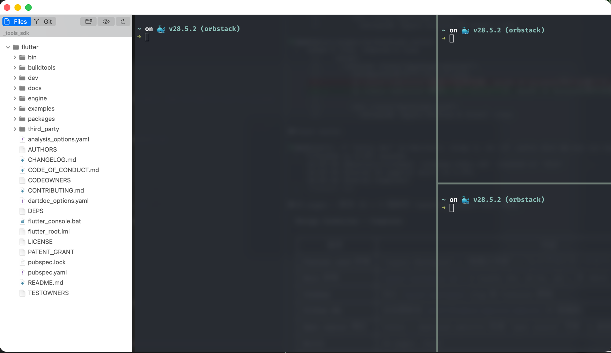

# Spectra

A comfortable, clean terminal app for macOS.

Spectra is a native macOS terminal built on [libghostty](https://github.com/ghostty-org/ghostty). Split panes, a file sidebar, GPU rendering, and nothing that gets in your way.

**[Website](https://spectra.librefox.app)** | **[Download](https://github.com/jerell2isekai/spectra/releases/latest)** | **[Docs](https://spectra.librefox.app/en/installation/)**

## Features

**Split panes** — Horizontal or vertical. Drag to resize. Each pane has its own tabs.

**File sidebar** — Browse files, see Git status, toggle dotfiles. Click to preview, right-click to Open With or Send Copy To another folder.

**VS Code themes** — Import VS Code color schemes for the app chrome. The terminal uses Ghostty's own theme system, so they work independently.

**GPU rendering** — Metal via libghostty. Smooth scrolling, sharp text, low latency.

**Saved layouts** — Name your pane arrangement, recall it later with one click.

**Guide sync** — Manage AGENTS.md and CLAUDE.md files from one place, push to any project.

**In-window preview** — Markdown, JSON, HTML, PDF, and images open right in the terminal, no external app needed.

**Settings panel** — Theme, font, opacity, blur, cursor style — all in one place, no config file editing.

**Native AppKit** — No Electron. Uses system appearance. Feels like it belongs on your Mac.

## Requirements

macOS 14 Sonoma or later, Metal-capable GPU.

## Install

Download from [GitHub Releases](https://github.com/jerell2isekai/spectra/releases/latest).

## Acknowledgments

Terminal rendering by [libghostty](https://github.com/ghostty-org/ghostty). Thanks to Mitchell Hashimoto and the Ghostty team.

## License

See [LICENSE](LICENSE).