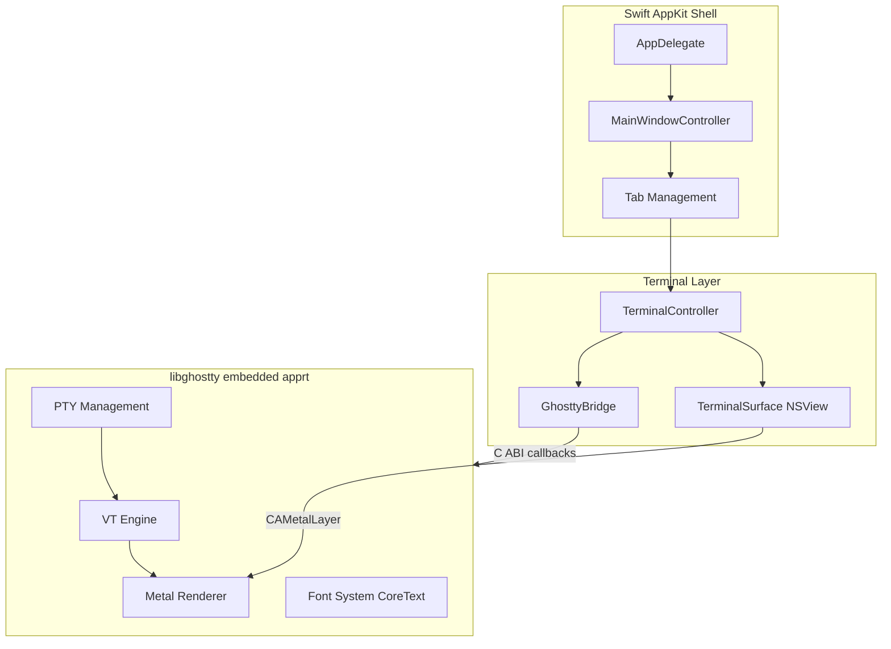

# Spectra — 開發待辦事項

macOS 原生終端模擬器，基於 Swift + AppKit + libghostty（完整版 embedded apprt）。

## 架構概覽

## Phase 0：環境準備

- [x] 安裝 Zig 工具鏈：`brew install zig` (v0.15.2)
- [x] Clone Ghostty 原始碼：`git clone https://github.com/ghostty-org/ghostty.git`
- [x] 執行 build script：`./scripts/build-ghostty.sh ../ghostty`
- [x] 確認產出 `lib/libghostty.a` (135MB) 和 `include/ghostty.h`
- [x] 執行 `swift build` 確認編譯通過

## Phase 1：libghostty 整合

核心任務：讓 `GhosttyBridge.swift` 的 TODO stub 變成真正的 libghostty 呼叫。

### 1.1 研究 Ghostty macOS 原始碼

- [x] 閱讀 Ghostty 的 `macos/Sources/Ghostty/Ghostty.App.swift` — 理解 `ghostty_runtime_config_s` 的完整回呼結構
- [x] 閱讀 `macos/Sources/Ghostty/Ghostty.Surface.swift` — 理解 surface 生命週期
- [x] 閱讀 `macos/Sources/Ghostty/Surface View/SurfaceView_AppKit.swift` — 理解 NSView + Metal 整合
- [x] 記錄完整的 callback 清單和每個 callback 的 signature

### 1.2 實作 GhosttyBridge

- [x] `initialize()` — 建立 `ghostty_config_t`，設定 `ghostty_runtime_config_s` 回呼，呼叫 `ghostty_app_new()`
- [x] `wakeup` 回呼 — 透過 `DispatchQueue.main.async` 觸發 `tick()`
- [x] `action` 回呼 — 處理 `set_title`、`new_tab`、`quit`、`ring_bell` 等 action
- [x] `read_clipboard` / `write_clipboard` 回呼 — 對接 `NSPasteboard`
- [x] `close_surface` 回呼 — 通知 `MainWindowController` 關閉對應 tab
- [x] `tick()` — 呼叫 `ghostty_app_tick()`
- [x] `shutdown()` — 呼叫 `ghostty_app_free()`

### 1.3 實作 TerminalSurface

- [x] `createSurface()` — 呼叫 `ghostty_surface_new()`，傳入 NSView 指標
- [x] libghostty 內部管理 Metal layer（不需手動建立 CAMetalLayer）
- [x] 鍵盤事件轉換 — 將 `NSEvent` 轉換為 `ghostty_input_key_s`
- [x] 滑鼠事件轉換 — `ghostty_surface_mouse_button/pos`
- [x] Scroll 事件轉發 — `ghostty_surface_mouse_scroll` with packed scroll mods
- [x] Resize 通知 — `ghostty_surface_set_size()` + `ghostty_surface_set_content_scale()`

### 1.4 首次渲染

- [x] 啟動 app，確認視窗出現且 Metal layer 初始化成功
- [x] 確認 shell prompt 顯示（PTY 由 libghostty 管理）
- [x] 確認基本文字輸入和輸出正常
- [x] 確認游標顯示和閃爍

## Phase 2：Tab 與視窗管理

- [x] 實作多 tab 切換（Cmd+1~9 快捷鍵）— 使用 macOS native window tabs
- [x] Tab bar UI — macOS 原生 tab bar（`NSWindow.tabbingMode = .preferred`）
- [x] 拖曳 tab 重排 — 原生 tab bar 免費提供
- [x] Cmd+T 新增 tab、Cmd+W 關閉 tab
- [x] 視窗標題動態更新（NotificationCenter from set_title action）
- [x] 多視窗支援（Cmd+N）
- [x] Cmd+Shift+]/[ 切換上/下一個 tab
- [x] Tab bar "+" 按鈕 (`newWindowForTab`)

## Phase 3：設定系統

- [x] 獨立 TOML config（`~/.config/spectra/config.toml`），不與 Ghostty 共用
- [x] TOML parser — 支援 `[section]`、`key = "value"`、`#` comments
- [x] ConfigManager — load/save/translate to ghostty format + file watching
- [x] Settings UI — macOS 原生 Preferences 視窗（NSToolbar: General/Appearance/Font）
- [x] 字型設定 — family, size, line-height（Settings UI + TOML → ghostty bridge）
- [x] 色彩主題 — theme name（Settings UI + TOML → ghostty bridge）
- [x] Cursor style + blink（Settings UI + TOML → ghostty bridge）
- [x] Background opacity — TOML → ghostty + window alpha
- [x] Window padding — TOML → ghostty renderer
- [x] Config hot-reload — file watcher + GHOSTTY_ACTION_RELOAD_CONFIG
- [x] Settings… (Cmd+,) — 開啟 Settings UI
- [x] Open Config File — 以系統預設編輯器開啟 TOML
- [x] Config change 通知 — NotificationCenter propagation

## Phase 4：差異化功能

- [x] Split pane — 水平 (Cmd+D) / 垂直 (Cmd+Shift+D) 分割，recursive split tree
- [x] Split navigation — ghostty keybindings (goto_split) + next/prev cycling
- [x] Split close — 關閉分割面板後自動 collapse tree
- [x] Command Palette (Cmd+P) — 搜尋 tabs/windows + 快速執行動作（split、settings、config）
- [x] Session persistence — 退出時保存視窗位置，重啟時恢復
- [ ] 內建 SSH 管理器（儲存 host、一鍵連線）
- [ ] 可擴展的 Lua/Swift plugin 系統

## Phase 5：打磨與發佈

- [ ] App icon 設計
- [ ] DMG / Sparkle 自動更新
- [ ] 效能基準測試（對比 Ghostty、iTerm2、Terminal.app）
- [ ] Accessibility（VoiceOver 支援）
- [ ] 提交 App Store（可選）

---

## 參考資源

| 資源 | 路徑 / URL |
|------|-----------|
| Ghostty 原始碼 | `https://github.com/ghostty-org/ghostty` |
| Ghostty macOS app | `ghostty/macos/Sources/Ghostty/` |
| libghostty C API | `ghostty/include/ghostty.h` |
| Embedded apprt 實作 | `ghostty/src/apprt/embedded.zig` |
| Metal renderer | `ghostty/src/renderer/Metal.zig` |
| Ghostling（最小範例） | `https://github.com/ghostty-org/ghostling` |
| libghostty-vt 文件 | `https://libghostty.tip.ghostty.org/` |
