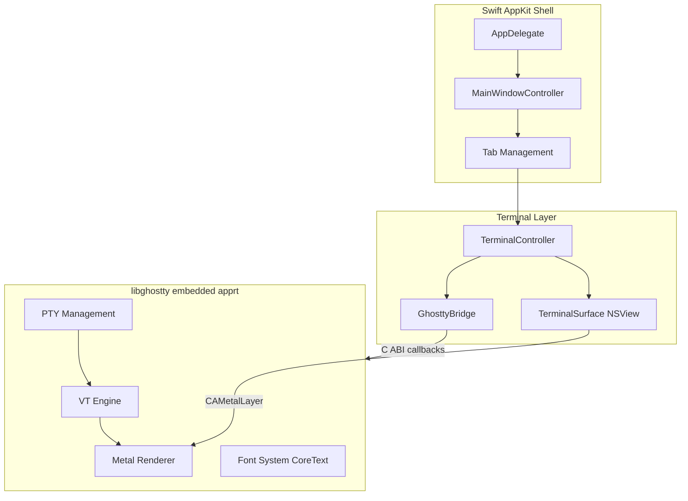

# Spectra — 開發待辦事項

macOS 原生終端模擬器，基於 Swift + AppKit + libghostty（完整版 embedded apprt）。

## 架構概覽

## Phase 0：環境準備

- [x] 安裝 Zig 工具鏈：`brew install zig` (v0.15.2)
- [x] Clone Ghostty 原始碼：`git clone https://github.com/ghostty-org/ghostty.git`
- [x] 執行 build script：`./scripts/build-ghostty.sh ../ghostty`
- [x] 確認產出 `lib/libghostty.a` (135MB) 和 `include/ghostty.h`
- [x] 執行 `swift build` 確認編譯通過

## Phase 1：libghostty 整合

核心任務：讓 `GhosttyBridge.swift` 的 TODO stub 變成真正的 libghostty 呼叫。

### 1.1 研究 Ghostty macOS 原始碼

- [x] 閱讀 Ghostty 的 `macos/Sources/Ghostty/Ghostty.App.swift` — 理解 `ghostty_runtime_config_s` 的完整回呼結構
- [x] 閱讀 `macos/Sources/Ghostty/Ghostty.Surface.swift` — 理解 surface 生命週期
- [x] 閱讀 `macos/Sources/Ghostty/Surface View/SurfaceView_AppKit.swift` — 理解 NSView + Metal 整合
- [x] 記錄完整的 callback 清單和每個 callback 的 signature

### 1.2 實作 GhosttyBridge

- [x] `initialize()` — 建立 `ghostty_config_t`，設定 `ghostty_runtime_config_s` 回呼，呼叫 `ghostty_app_new()`
- [x] `wakeup` 回呼 — 透過 `DispatchQueue.main.async` 觸發 `tick()`
- [x] `action` 回呼 — 處理 `set_title`、`new_tab`、`quit`、`ring_bell` 等 action
- [x] `read_clipboard` / `write_clipboard` 回呼 — 對接 `NSPasteboard`
- [x] `close_surface` 回呼 — 通知 `MainWindowController` 關閉對應 tab
- [x] `tick()` — 呼叫 `ghostty_app_tick()`
- [x] `shutdown()` — 呼叫 `ghostty_app_free()`

### 1.3 實作 TerminalSurface

- [x] `createSurface()` — 呼叫 `ghostty_surface_new()`，傳入 NSView 指標
- [x] libghostty 內部管理 Metal layer（不需手動建立 CAMetalLayer）
- [x] 鍵盤事件轉換 — 將 `NSEvent` 轉換為 `ghostty_input_key_s`
- [x] 滑鼠事件轉換 — `ghostty_surface_mouse_button/pos`
- [x] Scroll 事件轉發 — `ghostty_surface_mouse_scroll` with packed scroll mods
- [x] Resize 通知 — `ghostty_surface_set_size()` + `ghostty_surface_set_content_scale()`

### 1.4 首次渲染

- [x] 啟動 app，確認視窗出現且 Metal layer 初始化成功
- [x] 確認 shell prompt 顯示（PTY 由 libghostty 管理）
- [x] 確認基本文字輸入和輸出正常
- [x] 確認游標顯示和閃爍

## Phase 2：Tab 與視窗管理

- [ ] 實作多 tab 切換（Cmd+1~9 快捷鍵）
- [ ] Tab bar UI — 使用 `NSTabView` 或自訂 tab bar
- [ ] 拖曳 tab 重排
- [ ] Cmd+T 新增 tab、Cmd+W 關閉 tab
- [ ] 視窗標題動態更新（來自 libghostty 的 `set_title` action）
- [ ] 多視窗支援

## Phase 3：設定系統

- [ ] 設計設定檔格式（可考慮相容 Ghostty 的 config 格式）
- [ ] 字型設定（family、size、line height）
- [ ] 色彩主題（前景、背景、ANSI 16 色 + 256 色調色盤）
- [ ] Keybinding 自訂
- [ ] Cursor style（block / beam / underline）
- [ ] Padding 和 opacity 設定

## Phase 4：差異化功能

這是 Spectra 與 Ghostty 區隔的重點。以下為候選功能（依優先順序）：

- [ ] 分割面板（Split pane — 水平/垂直分割，獨立終端）
- [ ] 快速命令面板（Cmd+P 搜尋歷史、切換 tab、執行動作）
- [ ] Session 持久化（重啟後恢復 tab 和工作目錄）
- [ ] 內建 SSH 管理器（儲存 host、一鍵連線）
- [ ] 可擴展的 Lua/Swift plugin 系統

## Phase 5：打磨與發佈

- [ ] App icon 設計
- [ ] DMG / Sparkle 自動更新
- [ ] 效能基準測試（對比 Ghostty、iTerm2、Terminal.app）
- [ ] Accessibility（VoiceOver 支援）
- [ ] 提交 App Store（可選）

---

## 參考資源

| 資源 | 路徑 / URL |
|------|-----------|
| Ghostty 原始碼 | `https://github.com/ghostty-org/ghostty` |
| Ghostty macOS app | `ghostty/macos/Sources/Ghostty/` |
| libghostty C API | `ghostty/include/ghostty.h` |
| Embedded apprt 實作 | `ghostty/src/apprt/embedded.zig` |
| Metal renderer | `ghostty/src/renderer/Metal.zig` |
| Ghostling（最小範例） | `https://github.com/ghostty-org/ghostling` |
| libghostty-vt 文件 | `https://libghostty.tip.ghostty.org/` |
